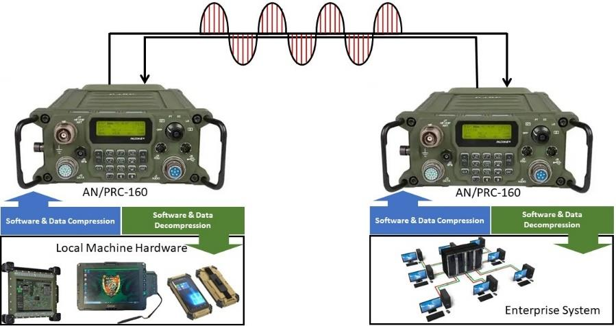
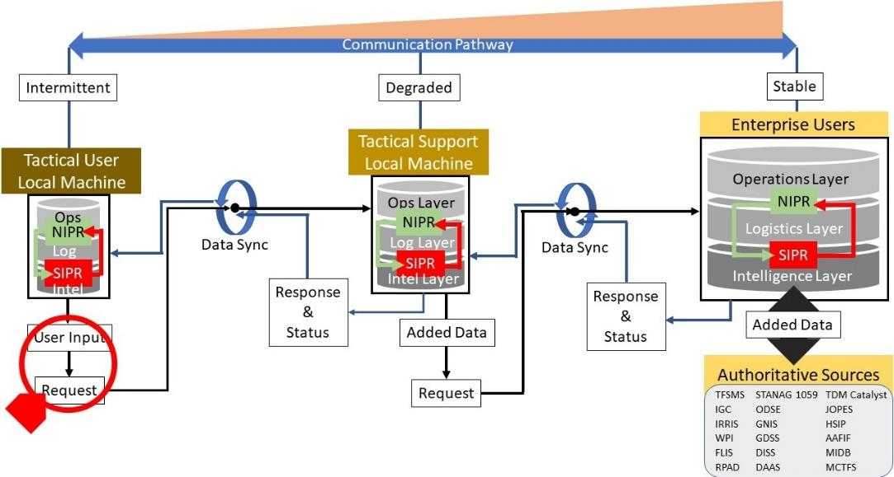
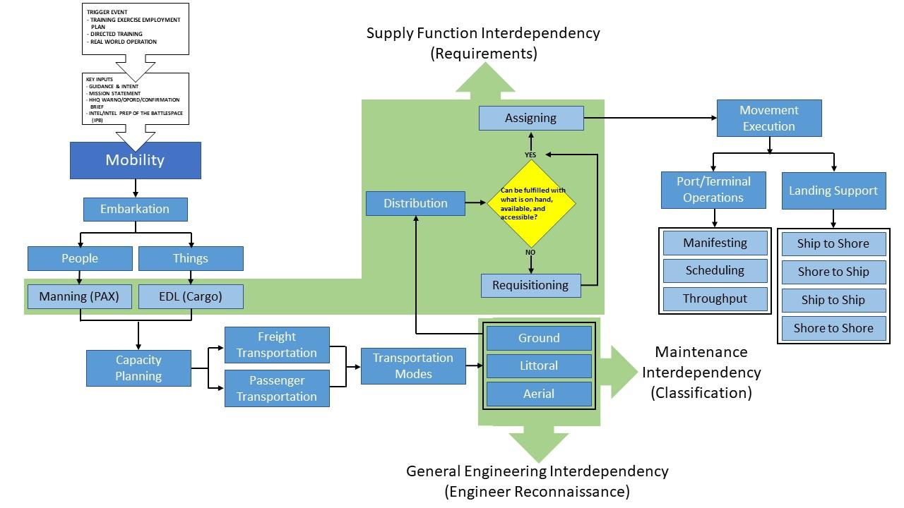
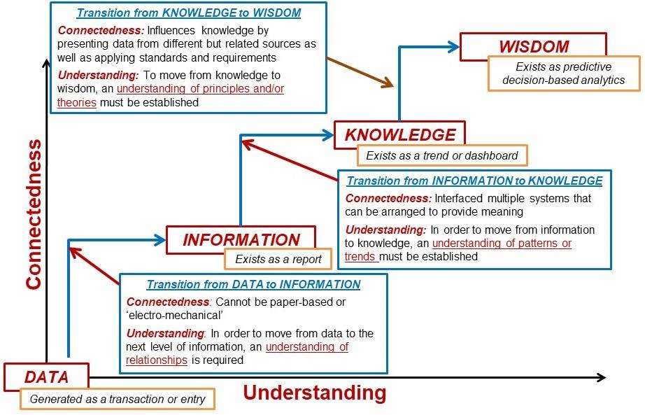

# section4


section4 is a Python project to implement the ideas in
[`project-adrian.txt`](./docs/project-adrian.txt): a logistics common
operational picture for contested, disconnected, degraded, and
intermittent environments that does more than display status. The goal
is a logistics COP that enables decision-making at the tactical edge.

The project is now centered on `LXDR`:

- `LXDR-Core`
  - ADRIAN-derived request header, segment schemas, and canonical field
    registry
- `LXDR-Link`
  - transport-agnostic delivery, sync, bundle, and DDIL exchange
    envelope
- `LXDR-Transport`
  - bearer adapters for whatever path is available, with HF data-burst
    as the lowest denominator design assumption

section4 is not trying to build a generic dashboard. It is trying to
build the logistics data and synchronization substrate that
`project-adrian.txt` argues is missing: critical data capture at the
point of need, connected/disconnected synchronization, and decision
support across the logistics functions.

## Demo Topology

For the hackathon demo, section4 still uses:

- `ATAK` on the Android EUDs as the field-node interface
- `s4net` TUI on the laptop as the local operator console
- `LXDR` underneath as the transport-agnostic protocol core

That split is intentional:

- the demo nodes can use familiar operational interfaces
- the laptop provides the local-first command and logistics view
- the protocol stays bearer-agnostic so the same core can ride over
  different transports in DDIL environments

## Canonical ADRIAN Workflows

The ADRIAN source document is the project guidebook. These extracted
figures show the canonical ideas section4 is implementing.

### HF Data Transmission



### Data Synchronization Pathway



### Mobility Interdependency



### Data to Decision Support



## Why This Stack

section4 follows the source material under [`docs/`](./docs), with
`project-adrian.txt` as the normative design document for the protocol
and workflow model.

The ADRIAN document is explicit that:

- logistics data capture has to work with connected and disconnected
  synchronization
- the solution must span the five analyzed logistics functions as one
  homogeneous data system
- the right data has to get from the right sensor to the right
  logistician at the right time
- the point-of-need user in a communication-constrained environment is
  the design center

Those requirements drive the protocol and application architecture more
than any one transport or UI choice.

## Planned Capabilities

section4 is being built to provide:

1. ADRIAN request creation using generated headers and function-specific
   segments
2. DDIL-friendly exchange using canonical text bursts, structured link
   frames, packed representations, and synchronization bundles
3. a local-first operator interface for working with logistics requests,
   status, and history
4. a logistics COP that supports decision-making, not just display
5. an ADRIAN-specialized LLM workflow to reason over logistics requests,
   supportability, routing, synchronization state, and decision options

The first concrete workflow still looks like:

1. A forward node reports a failed component and low local stock
2. section4 ingests the report and stores it locally
3. section4 ranks candidate courses of action:
   - local repair
   - additive fabrication
   - reroute from another node
4. A task is assigned to a capable responder node
5. section4 publishes operational state to ATAK clients via CoT
6. The ALOC UI shows readiness impact, ETA, task state, and audit
   history

But the longer-term objective is broader: implement the ADRIAN logistics
data model and make it operationally useful for command and sustainment
decisions.

## Project Status

This repository is being built in stages:

1. `section4` project identity and local operator tooling
2. ADRIAN-derived `LXDR` protocol specification
3. `LXDR-Core` models and canonical field registry
4. `LXDR-Link` serialization, packed codecs, and sync bundles
5. next: router, outbox/inbox, and DDIL message handling

## Development

This project uses [`uv`](https://docs.astral.sh/uv/) for environment
and dependency management.

### Install dependencies

```bash
uv sync
```

### Bootstrap the local database

```bash
uv run python -m section4.app bootstrap
```

### Run the app

Bootstrap once, then launch the local ALOC console:

```bash
uv run python -m section4.app bootstrap
uv run python -m section4.app tui
```

Other useful commands:

```bash
uv run python -m section4.app init-db
uv run python -m section4.app seed-demo
uv run python -m section4.app publish-incident
uv run python -m section4.app publish-capability
uv run python -m section4.app receive-once
```

### Lint

```bash
uv run ruff check .
uv run ruff format .
```

## Initial Technical Decisions

- Language: Python 3.12
- Dependency management: `uv`
- Linting and formatting: `ruff`
- First UI: `urwid` TUI
- Persistence: SQLite + SQLAlchemy
- Protocol core: `LXDR`
- Lowest transport assumption: HF data-burst
- Structured link/debug representation: JSON
- Constrained representation: packed codecs derived from ADRIAN field
  lengths
- One major goal: train or specialize an ADRIAN LLM model for the
  hackathon solution

## Non-Goals For MVP

- No dependency on a single transport stack
- No assumption of persistent connectivity
- No generic logistics dashboard detached from ADRIAN
- No premature cloud-first architecture
- No heavyweight SPA frontend unless the workflow proves it is
  necessary
