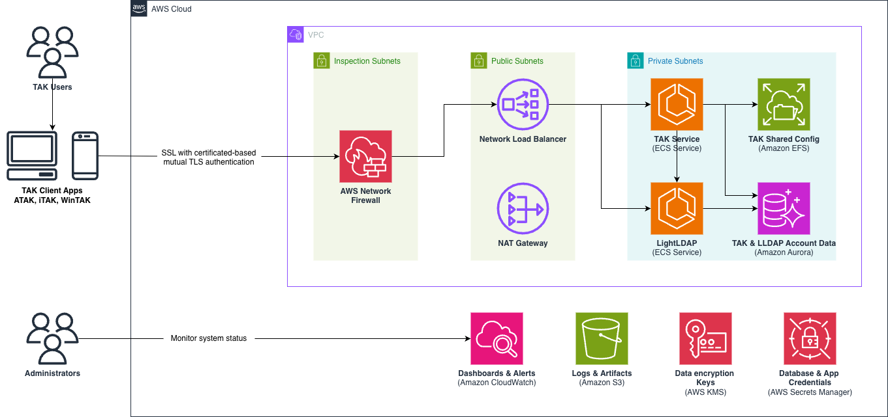

# Serverless TAK Server on AWS

This sample demonstrates a cloud-native, serverless implementation of TAK Server (Team Awareness Kit) on AWS. This solution transforms the traditional monolithic TAK Server deployment into a highly available, auto-scaling, and cost-optimized serverless architecture using AWS managed services.

## What is TAK?

The Team Awareness Kit (TAK) is a situational awareness and geospatial collaboration software suite developed by the TAK Product Center. Originally created for military operations, TAK has evolved into a flexible platform used for emergency management, disaster response, law enforcement, and search & rescue operations. TAK enables teams to share real-time location data, mission updates, and operational information across mobile, desktop, and server-based environments.

## Why Serverless TAK?

Traditional TAK Server deployments face several challenges:
- **Limited Scalability**: Monolithic architecture doesn't scale with demand
- **High Operational Overhead**: Requires extensive domain knowledge to configure and maintain
- **Poor Cost Optimization**: Resources run continuously regardless of usage
- **Complex Cloud Deployment**: Not designed for cloud-native capabilities

This sample implementation addresses these challenges by providing:
- ✅ **Serverless Architecture**: Auto-scaling compute and database resources
- ✅ **Infrastructure as Code**: One-command deployment using AWS CDK
- ✅ **Cost Optimization**: Pay only for what you use with automatic scaling to zero
- ✅ **High Availability**: Built-in resilience across multiple Availability Zones
- ✅ **Enhanced Security**: Network Firewall with geo-filtering enabled by default
- ✅ **Simplified Operations**: Minimal maintenance with automated certificate management

## Architecture Overview

This sample leverages AWS serverless and managed services to create a resilient, scalable TAK Server deployment.



### Core Components

- **Amazon ECS Fargate**: Serverless compute for TAK Server containers
- **Amazon Aurora Serverless v2**: Auto-scaling PostgreSQL database
- **Amazon EFS**: Persistent storage for TAK Server configuration
- **Network Load Balancer**: High-performance load balancing for TAK protocols
- **AWS Network Firewall**: Geographic filtering (US-only by default) and advanced security
- **Amazon S3**: Secure storage for certificates and application data
- **AWS Secrets Manager**: Secure credential management

### Additional Components

- **LLDAP Server**: Lightweight LDAP implementation for user management
- **Let's Encrypt Integration**: Automated SSL certificate provisioning and renewal
- **Route53**: DNS management for custom domains

## Prerequisites

Before deploying this sample, ensure you have the following:

### Required Tools

1. **AWS CLI** - [Installation Guide](https://docs.aws.amazon.com/cli/latest/userguide/getting-started-install.html)
   ```bash
   aws configure
   ```

2. **Node.js 18+** - [Download from nodejs.org](https://nodejs.org/)
   ```bash
   node --version  # Should be 18.0.0 or higher
   ```

3. **Docker** - [Installation Guide](https://docs.docker.com/get-docker/)
   ```bash
   docker --version
   ```

4. **AWS CDK** - [CDK Getting Started](https://docs.aws.amazon.com/cdk/v2/guide/getting_started.html)
   ```bash
   npm install -g aws-cdk
   ```

   > Note: If this is the first time CDK is being used in this AWS account/region, you'll need to [bootstrap it](https://docs.aws.amazon.com/cdk/v2/guide/bootstrapping-env.html).

### Domain Requirements

**⚠️ CRITICAL: Domain Setup Required**

This sample requires a publicly routable domain managed by Route53 in the same AWS account where you're deploying. This is essential for:
- Automated Let's Encrypt certificate verification
- DNS-based certificate validation
- Proper SSL/TLS configuration

**Domain Setup Steps:**

1. **Register or transfer a domain** to Route53 - [Route53 Domain Registration](https://docs.aws.amazon.com/Route53/latest/DeveloperGuide/domain-register.html)

> Note: If you don't want to transfer an existing domain, you can also [delegate a subdomain to Route53 without migrating the parent domain](https://docs.aws.amazon.com/Route53/latest/DeveloperGuide/CreatingNewSubdomain.html).

2. **Create a Route53 Hosted Zone** - [Creating Hosted Zones](https://docs.aws.amazon.com/Route53/latest/DeveloperGuide/CreatingHostedZone.html)

3. **Note your Hosted Zone ID** from the Route53 console

**Your services will be deployed to subdomains of your hosted zone domain:**
- **TAK Server**: `tak.yourdomain.com`
- **LLDAP Admin** (if deployed): `ldap.yourdomain.com`

## Quick Start

### 1. Clone and Setup

```bash
git clone https://github.com/aws-samples/sample-serverless-tak
cd sample-serverless-tak
npm install
```

### 2. Configure Deployment

Copy the example configuration and customize for your environment:

```bash
cp config.example.yaml config.yaml
```

Edit `config.yaml` with your settings:

```yaml
# AWS Account and Region Configuration
env:
  account: "123456789012"           # Your AWS account ID
  region: "us-east-1"               # AWS region for deployment
  isDevelopmentEnvironment: false   # Set to true for dev/testing

# Network Firewall Configuration (enabled by default)
firewall:
  enabled: true                     # AWS Network Firewall for security
  name: "TAK-Server-Firewall"       # Custom firewall name
  geoAllow: ["US"]                  # Allow only US traffic (allowlist)
  connectionTimeout: 300            # Connection timeout in seconds

# TAK Server Configuration
tak:
  adminEmail: admin@yourdomain.com  # Email for Let's Encrypt certificates
  authType: FILE                    # Authentication type: FILE or LDAP
  domainName: "yourdomain.com"      # Your Route53 domain
  subdomainName: "tak"              # TAK Server subdomain
  hostedZoneId: "Z1234567890ABC"    # Your Route53 Hosted Zone ID
  
  # Certificate Information
  certCountry: US
  certState: VA
  certCity: Arlington
  certOrg: "Your Organization"
  certOrgUnit: "IT Department"
  
  # LDAP Configuration (only if authType: LDAP)
  ldap:
    deployLdapServer: true          # Deploy included LLDAP server
    baseDn: "dc=tak,dc=local"       # LDAP base DN
```

### 3. Download the TAK Server Distribution

Download the official TAK Server Docker distribution:

1. Visit [tak.gov](https://tak.gov) and create an account
2. Download the latest TAK Server Docker distribution
3. Place the downloaded zip file in the `tak-server/takserver-docker-distro` directory. 

> Note: the name of the file should look something like **takserver-docker-5.5-RELEASE-45.zip**.

### 4. Deploy Infrastructure

Deploy the complete serverless TAK solution:

```bash
cdk deploy --all
```

### 5. Access Your TAK Server

Once deployed, your TAK Server will be available at:
- **TAK Server**: `tak.yourdomain.com:8089` (for ATAK/iTAK clients)
- **Admin Console**: `https://tak.yourdomain.com:8443` *(requires admin certificate - see step 6)*
- **LDAP Admin** (if deployed): `https://ldap.yourdomain.com`

### 6. Install Admin Certificate for TAK Server Admin Console Access

To access the TAK Server admin console at `https://tak.yourdomain.com:8443`, you must download and install the admin certificate that gets automatically generated and uploaded to S3.

**Download the admin certificate:**

1. **Open the AWS Console** and navigate to **Amazon S3**
2. **Find your TAK data bucket**:
   - Look for a bucket with a name like: `coreinfrastack-takdatabucketXXXXXXXXXX`
3. **Navigate to the certificate**:
   - Go to the folder: `TAK/certs/`
   - Download the file: `admin.p12`

**Install the certificate in your browser:**

**Retrieve the keystore password from AWS Secrets Manager:**

Before installing the certificate, you'll need to get the keystore password:

1. **Open the AWS Console** and navigate to **AWS Secrets Manager**
2. **Find the keystore secret**:
   - Look for a secret with a name like: `TakServerKeystoreSecret-XXXXXXXXXX`
   - The secret description will be "TAK Server keystore passwords"
3. **Retrieve the password**:
   - Click on the secret name
   - Click **"Retrieve secret value"**
   - Note the `password` field value - this is your keystore password

**For Chrome/Edge:**
1. Go to **Settings** → **Privacy and security** → **Security** → **Manage certificates**
2. Click **Import** and select the downloaded `admin.p12` file
3. Enter the keystore password from Secrets Manager when prompted
4. Install the certificate in the **Personal** certificate store
5. Restart your browser

**For Firefox:**
1. Go to **Settings** → **Privacy & Security** → **Certificates** → **View Certificates**
2. Click **Import** and select the downloaded `admin.p12` file
3. Enter the keystore password from Secrets Manager when prompted
4. Restart Firefox

**For Safari (macOS):**
1. Double-click the `admin.p12` file to open **Keychain Access**
2. Enter the keystore password from Secrets Manager when prompted
3. The certificate will be added to your **login** keychain
4. Right-click the certificate and select **Get Info** → **Trust** → **Always Trust**

> **Important**: The admin certificate is required for secure access to the TAK Server admin console. Without it, you'll receive SSL certificate errors when trying to access `https://tak.yourdomain.com:8443`.

### 7. LLDAP Initial Setup (If Using LDAP Authentication)

If you deployed with LDAP authentication (`authType: LDAP` and `deployLdapServer: true`), you'll need to retrieve the auto-generated admin credentials to access the LLDAP web interface and create users.

**To retrieve your LLDAP admin credentials:**

1. **Open the AWS Console** and navigate to **AWS Secrets Manager**
2. **Find the LLDAP Admin Secret**:
   - Look for a secret with a name like: `LdapServerLdapAdminSecret-XXXXXXXXXX`
   - The secret description will be "LLDAP admin password"
3. **Retrieve the credentials**:
   - Click on the secret name
   - Click **"Retrieve secret value"**
   - Note the `username` (should be "admin") and `password`

**Access LLDAP and create users:**

1. **Navigate to your LLDAP web interface**: `https://ldap.yourdomain.com`
2. **Log in** using the credentials from Secrets Manager:
   - Username: `admin`
   - Password: `[password from Secrets Manager]`
3. **Create users and groups** as needed for your TAK Server deployment

> **Important**: The LLDAP admin password is automatically generated during deployment for security. You must retrieve it from AWS Secrets Manager to access the LLDAP interface and manage users.

## Cleanup
To clean up the environment and delete all provisioned infrastructure, run:
```bash
cdk destroy --all --require-approval never
```

> Note: this will NOT delete non-empty S3 buckets (like the one with certs), so you will need to delete those manually

## Contributing

We welcome contributions! Please see our [Contributing Guide](CONTRIBUTING.md) for details.

## Security

See [CONTRIBUTING](CONTRIBUTING.md#security-issue-notifications) for more information.

## License

This library is licensed under the MIT-0 License. See the [LICENSE](LICENSE) file.
